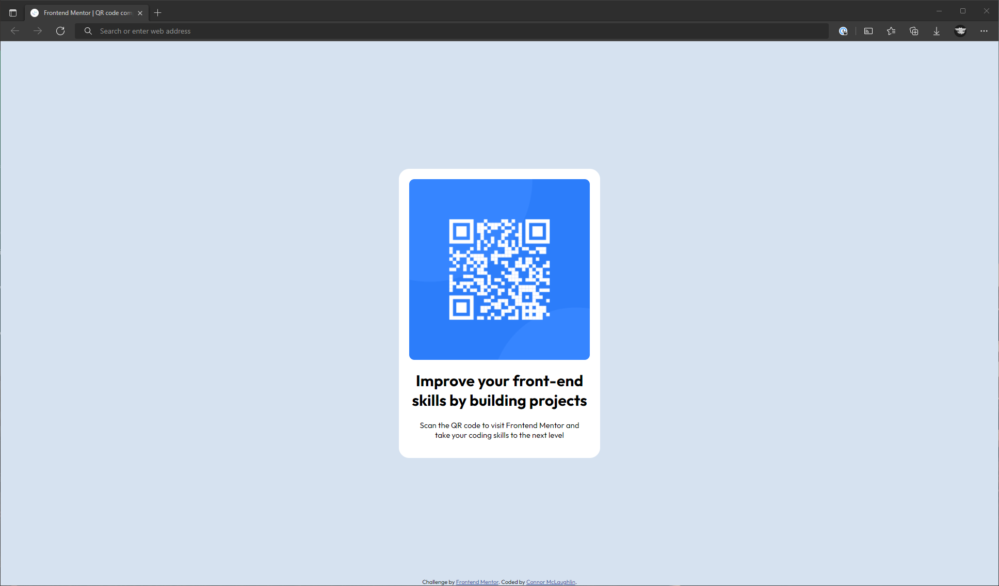
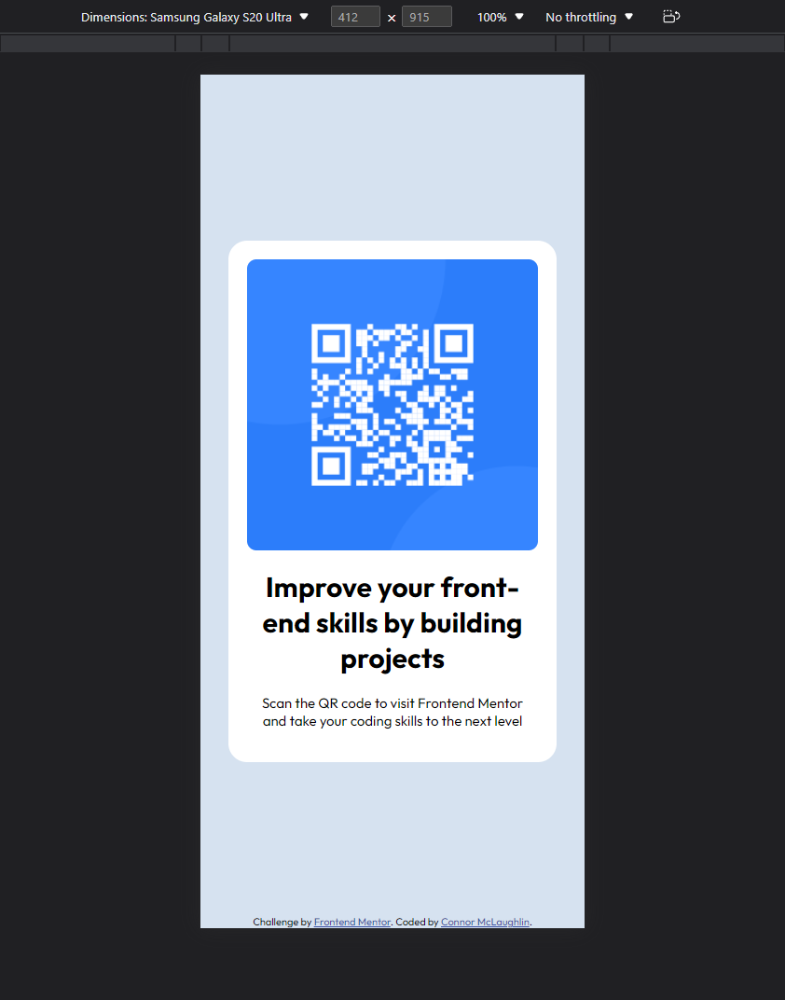

# Frontend Mentor - QR code component solution

This is a solution to the [QR code component challenge on Frontend Mentor](https://www.frontendmentor.io/challenges/qr-code-component-iux_sIO_H). Frontend Mentor challenges help you improve your coding skills by building realistic projects. 

## Table of contents

- [Overview](#overview)
  - [Screenshot](#screenshot)
  - [Links](#links)
- [My process](#my-process)
  - [Built with](#built-with)
  - [Useful resources](#useful-resources)
- [Author](#author)

## Overview

### Screenshot
- Desktop

- Mobile

## Links

- Solution URL: [https://github.com/CBMcLaughlin/FM-QRComp](https://github.com/CBMcLaughlin/FM-QRComp)
- Live Site URL: [https://cbmclaughlin.github.io/FM-QRComp/](https://cbmclaughlin.github.io/FM-QRComp/)

## My process

### Built with

- HTML5 Markup
- CSS custom properties
- Flexbox
- Mobile-first workflow

## Useful resources

- [Flexbox Cheat Sheet](https://css-tricks.com/snippets/css/a-guide-to-flexbox/) - This served as a handy reference when setting up the flex containers.

## Author

- Frontend Mentor - [@CBMcLaughlin](https://www.frontendmentor.io/profile/CBMcLaughlin)
- LinkedIn - [Connor McLaughlin](https://www.linkedin.com/in/connor-mclaughlin-3b89a4183/)

